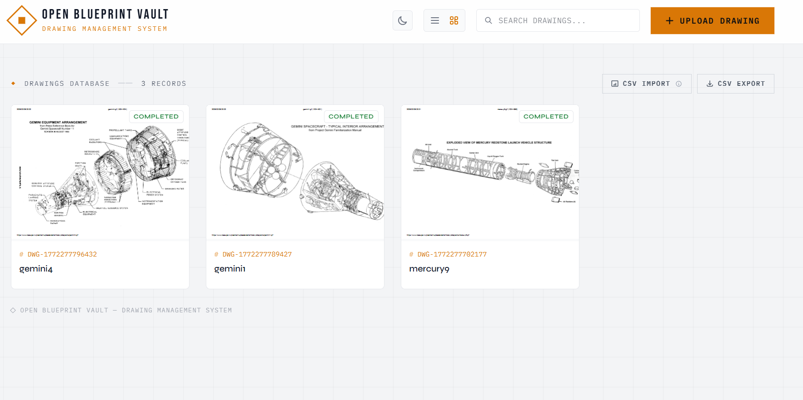

# OpenBlueprintVault



Engineering drawing management system. Upload PDF drawings, manage metadata, and store files in S3-compatible storage.

## Motivation

Managing engineering drawings, revisions, and metadata shouldn't require expensive enterprise PDM/PLM systems for every team. OpenBlueprintVault provides a modern, open-source, and self-hostable alternative designed specifically for hardware engineers and manufacturing teams who need a clean, fast, and reliable way to manage their design documents.

## Features

- **S3-Compatible Storage:** Safely store your PDF blueprints using MinIO or AWS S3.
- **Revision Control:** Keep track of drawing revisions without losing history.
- **Advanced Metadata:** Manage drawing numbers, part names, and custom attributes.
- **Fast Search & Filtering:** Quickly find the exact drawing you need.
- **Bulk CSV Import/Export:** Easily migrate existing databases or batch-update records.
- **Modern UI:** Built with Next.js and Tailwind CSS for a professional, snappy experience including dark mode support.
- **Docker-Ready:** Spin up the entire stack in seconds with Docker Compose.

## Architecture

```
Frontend (Next.js :3000)
    |
    v
Backend (NestJS :3001)
    |
    |---> PostgreSQL (:5432)   ... Metadata storage
    +---> MinIO (:9000)        ... PDF file storage
```

## Tech Stack

| Layer | Technology |
|-------|------------|
| Frontend | Next.js 16 / React 19 / Tailwind CSS 4 |
| Backend | NestJS 11 / Prisma / TypeScript |
| Storage | MinIO (S3-compatible) |
| Database | PostgreSQL |
| Infrastructure | Docker Compose |

## Getting Started

### Prerequisites

- Docker & Docker Compose

### Option A: Start Everything with Docker (Recommended)

> **⚠️ Security Warning:** The default credentials in `.env.example` are strictly for local testing. If you are deploying this application for actual use or exposing it to the internet, **you MUST change all default passwords and secret keys** in the `.env` file before starting the services. Ensure you also update the `DATABASE_URL` to match your new database credentials.

```bash
cp .env.example .env
npm run up
```

This starts all services:

- Frontend: `http://localhost:3000`
- Backend: `http://localhost:3001`
- MinIO Console: `http://localhost:9001`

Stop all services:

```bash
npm run down
```

### Option B: Local Development (Run Frontend/Backend on Host)

Node.js v20+ is required.

#### 1. Start Infrastructure Only with Docker

```bash
npm run infra:up
```

#### 2. Start Backend

```bash
cd backend
npm install
npx prisma migrate dev
npm run start:dev
```

Backend: `http://localhost:3001`

#### 3. Start Frontend

```bash
cd frontend
npm install
npm run dev
```

Frontend: `http://localhost:3000`

## Testing

### Backend Tests

```bash
cd backend
npm run test
```

### Frontend Tests

```bash
cd frontend
npm run test
```

## Usage

1. Open `http://localhost:3000`
2. Upload a PDF drawing
3. Edit drawing number, part name, revision, and additional metadata as needed

## Project Structure

```
.
├── frontend/
├── backend/
│   ├── src/
│   └── prisma/
├── docker-compose.yml
└── package.json
```

## Contact

europeanplaice@gmail.com


